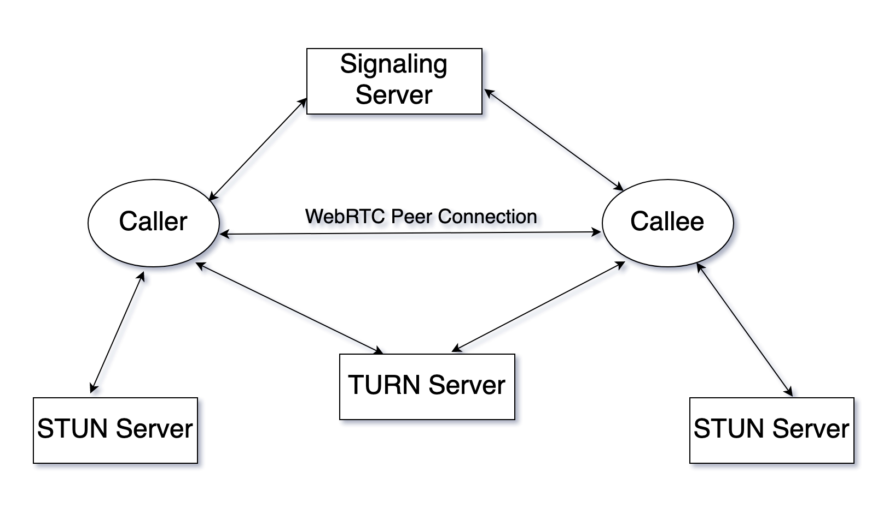

# WebRTC

- Realtime communication for the web
- With WebRTC, you can add real-time communication capabilities to your application that works on top of an open standard.
- The technologies behind WebRTC are implemented as an open web standard and available as regular JavaScript APIs in all major browsers.

> **Note**
>
> 1. For native clients, like Android and iOS applications, a library is available that provides the same functionality.
> 2. WebRTC works only over `https` and NOT `http`. Make sure to configure https before testing any code.

**Titles**

- [Couple of Keywords/Terms](#couple-of-keywordsterms)
- [High Level P2P Architecture](#high-level-p2p-architecture)
- [WebRTC Terms Explained](#webrtc-terms-explained)
- [ICE](#ice)
- [Application Flow](#application-flow)
- [WebRTC APIs](#webrtc-apis)

---

## Couple of Keywords/Terms

- `STUN` (server): Session Traversal Utilities for NAT
- `SDP`: Session Description Protocol
- `ICE Candidate`: Interactive Connectivity Establishment
- `TURN` (server): Traversal Using Relay NAT (Usually comes into picture when `STUN` server fails)
- `Signaling Server`: Any platform or means of communication where connection info could be shared between parties.

## High Level P2P Architecture

## WebRTC Terms Explained

- **WebRTC**: Peer to peer connection to exchange media info/data through browser
- **Signaling Server**:
  - Not WebRTC specific
  - To exchange info required to establish p-2-p connection between users
  - eg: webSocket, xmlHttpRequest, email, whatsapp, etc
- **STUN**: Allows clients to discover their public IP address/port and the type of NAT they are behind.
  - This info is used to establish the media connection
  - Works for `One to One NAT` (Full-cone NAT), Port/Address restricted NAT
  - Does not work for symmetric NAT
  - STUN server port 3478, 5349 for TLS (usually but not necessarily)
  - Cheap to maintain
  - In 15-20% cases `STUN` will fail and we'll need `TURN` server
- **TURN**: Protocol for relaying network traffic
  - used as an assist to establish connection between peers
  - TURN servers are not public because of the costs which they can generate out of the traffic going through them
- **SDP**: To describe multimedia communication sessions for the purposes of session announcement and session invitation.
  - It does not deliver the media data but is used for negotiation between peers of various `audio and video codecs`, `source address`, `timing info of audio and video`.
  - A format that describes ICE candidates, networking options and other stuff
  - Not really a protocol, it's a format
  - Most important concept in WebRTC
  - The goal is to take the SDP generated by a user and send it somehow to the other party.
- **ICE Candidate**:

  - Info about the network connection
  - It details the available methods the peer is able to communicate (directly or through `TURN` server)
  - Typically, each peer will propose its best candidates first, making their way down the line towards their worse candidates
  - Ideally candidates are `UDP` (faster and media streams are able to recover from interruptions relatively easily), but the `ICE` standard does allow `TCP` candidate as well

  > So, SDP exchanged initially contains ICE candidate as well and later on ICE trickling happens which provides best candidate. ie. best route, connectivity info.
  >
  > **Note**: Find more about NAT [here](../protocols/nat.md)

- **ICE Trickling**:
  - Send SDP offer without ICE candidate
  - Send individual ICE candidate as it is discovered by local ICE agent
  - Register remote ICE candidate and begin connectivity checks
  - Trickle ICE generates more traffic over the signaling channel, but it helps significant improvement in time required to initiate the p-2-p connection
  - In short, send the offer ASAP and then trickle ICE candidates as they are discovered

> In WebRTC, no guarantees that once the connection is established that it will stay that way. The connection may periodically flip between connected.
>
> ICE agent will attempt to find the best possible path to re-establish connectivity.

## ICE

- A framework
- The framework algorithm looks for the `lowest-latency` path for connecting the two peer, trying following options in order
  1. Direct UDP (+STUN)
  2. Direct TCP, via HTTP
  3. Direct TCP, via HTTPS
  4. Indirect connection via relay/TURN

## Application Flow

- A WebRTC application will usually go through a common application flow. Accessing the media devices, opening peer connections, discovering peers, and start streaming.

Eg:

1. `A` wants to connect to `B`
2. `A` creates an "offer", it finds all ICE candidates, security options, audio/video options and generates SDP, the offer is basically the SDP
3. `A` signals the offer somehow to `B`
4. `B` creates the "answer" after setting `A`'s offer
5. `B` signals the "answer" to `A`
6. Connection is created

## WebRTC APIs

- The WebRTC standard covers, on a high level, two different technologies:
  1. `media capture devices` and
  2. `peer-to-peer connectivity`
- For `cameras` and `microphones` : `navigator.mediaDevices.getUserMedia()` to capture `MediaStreams`
- For `screen recording` : `navigator.mediaDevices.getDisplayMedia()`
- The peer-to-peer connectivity is handled by : `RTCPeerConnection`
  - This is the central point for establishing and controlling the connection between two peers in WebRTC.
