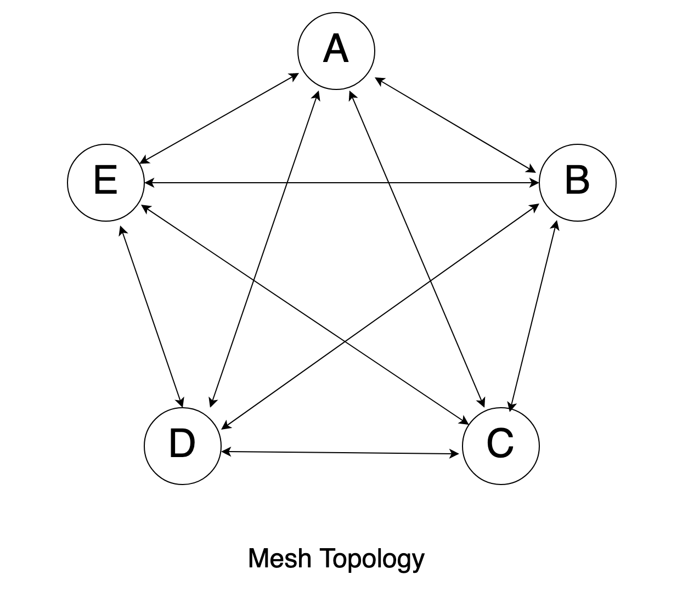
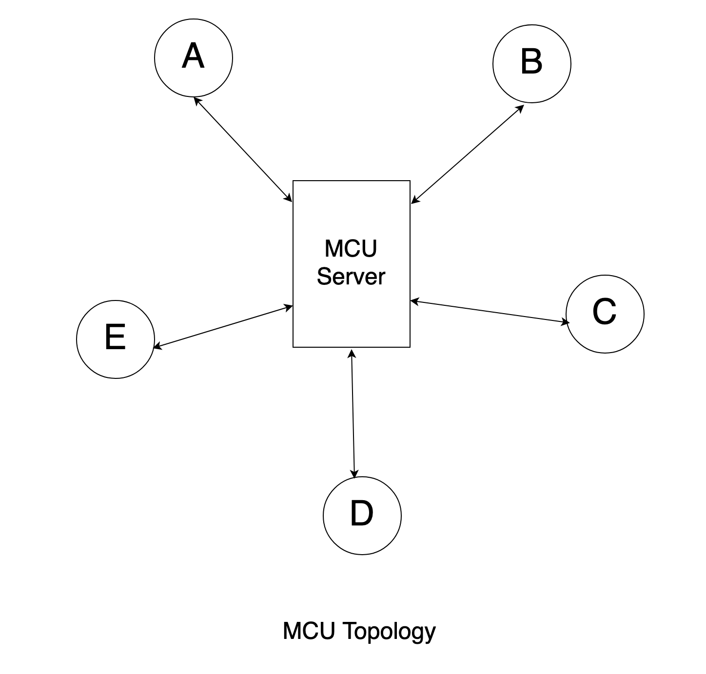
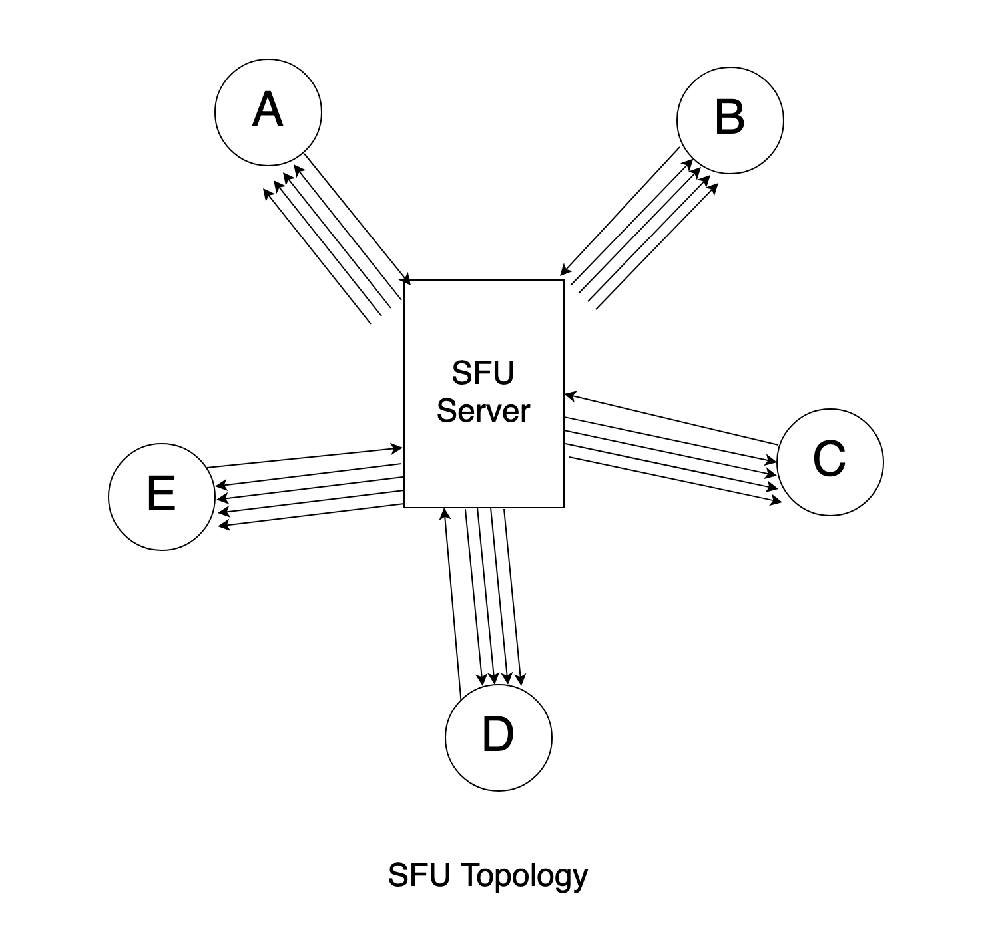

# Topology

**Titles**

- [Peer to Peer (p2p) / Mesh Topology](#peer-to-peer-p2p--mesh-topology)
- [MCU (Multipoint Conferencing Unit) Topology](#mcu-multipoint-conferencing-unit-topology)
  - [Advantages of MCU](#advantages-of-mcu)
  - [Disadvantage of MCU](#disadvantage-of-mcu)
- [SFU (Selective Forwarding Unit) Topology](#sfu-selective-forwarding-unit-topology)
  - [Advantages of SFU](#advantages-of-sfu)
- [WebRTC Gateway (also known as WebRTC to PSTN)](#webrtc-gateway-also-known-as-webrtc-to-pstn)

---

## Peer to Peer (p2p) / Mesh Topology

- Every peer establishes a connection with every other peer in the network
- There are `n*(n-1)` number of connections
- Each participant in a session directly connects to all other participants without the use of a server
- All the work (encoding/decoding etc) is done on the browser
- At each client's end, there are two entirely different `RTCPeerConnection`
- You can't reuse ICE candidates between them
- For the connection to be possible, each peer that uses the `RTCPeerConnection` API must create a connection object
- This connection object adds all the relevant info (video, audio stream, STUN/TURN, ICE)

## MCU (Multipoint Conferencing Unit) Topology

- MCUs: Multipoint Control Units
- It requires very little intelligence in device endpoint
- Each peer in the group call establishes a connection with the `MCU` server to send up its video and audio
- Streams from all participants get collected in a central entity which then sends back a single stream to each participant
- `MCU` makes sure that each participant gets only one set of video & audio
- The `MCU` decodes each received stream and rescale it
- Ensure much greater quality and more stable video/audio quality
- All the work is done on server side

### Advantages of MCU

- Perfect for large group of participants
- Bandwidth always stays stable at approximately 2Mb
- The `MCU` approach requires very little intelligence in device endpoint

### Disadvantage of MCU

- Its cost
- It decodes and re-encodes streams to compose the final stream, hence it requires significant computing power
- A secondary disadvantage is in delay (waiting for the complete frame to encode)

## SFU (Selective Forwarding Unit) Topology

- It is the most popular modern approach
- Every participant sends media stream to a centralized server (SFU)
- Every participant receives streams from all other participants via the same central server
- The device endpoints need to be more intelligent
- `SFU` is capable of receiving multiple media streams from participants
- `SFU` may decide which of the media streams should be forwarded to the other call participants
- The `SFU` is only responsible for forwarding media streams between participants
- Unlike in the `MCU` architecture the `SFU` does not need to decode and re-encode received streams
- The device endpoints need to be more intelligent and have more computing power

### Advantages of SFU

- Scalability of the architecture
- Since every participant may send multiple versions of the same media stream, it provide support for various screen layouts
- `SFU` can work with asymmetric bandwidth (Higher downlink bandwidth than uplink bandwidth)
- `SFU` is just a "forwarder" - server load is minimum

## WebRTC Gateway (also known as WebRTC to PSTN)

WebRTC gateways provide a bridge between WebRTC applications and traditional telephony networks, such as the public switched telephone network (PSTN). These gateways enable communication between WebRTC endpoints and non-WebRTC devices, allowing users to make and receive calls to/from regular telephones. WebRTC gateways handle the conversion between the different protocols used in WebRTC and the PSTN.

---

Q. Does SFU fit all use cases?

Ans. No. What's next? **Hybrid** (Combination of topologies)
